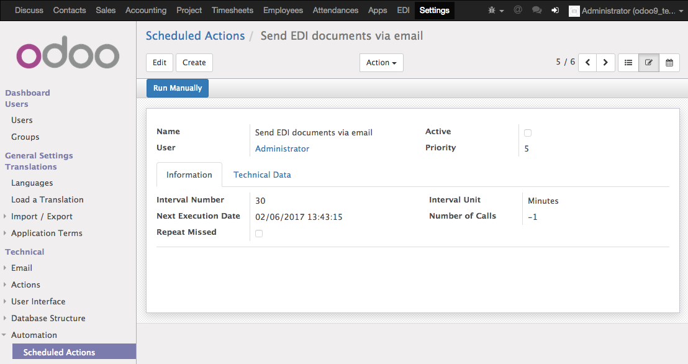

EDI Manager Documentation
=========================

Configuration
-------------

EDI Messages
''''''''''''

At first, an EDI message which will be used to send a particular business object needs to be defined in the EDI Messages section.

EDI Templates
'''''''''''''

Then an EDI template has to be created. The template name, the EDI message type and the business object type can be set here.

Next upon clicking the "Select Related Entities" button the relationships dialog appears. This dialog allows to select which relationships from the connected business object will be added into the xml file which will be sent afterwards. The selection process is finished by clicking on the "Confirm" button.

EDI Document Partners
'''''''''''''''''''''

Every contact in Odoo can have multiple EDI documents partners with different GLNs connected to it. EDI document partners can be selected as recipients of EDI documents.

.. figure:: edi_recipients.png
   :align: left

The CRON Job To Send EDI Documents
''''''''''''''''''''''''''''''''''

All EDI Documents in the "To Be Sent" stage are automatically processed and sent by a CRON job. To configure it a user with "Administration" access rights is necessary. Next the developer mode in Odoo has to be activated by the following procedure.

1. Click on your user name in the top right corner to access the drop down menu.
2. Select the "About OpenERP" option.
3. Click on the "Activate the developer mode" button in the displayed pop up dialog.

The CRON job can be found in "Settings -> Automation -> Scheduled Actions -> Send EDI documents via email". The CRON job is inactive by default and can be activated here.

Target Email Address
''''''''''''''''''''

All outgoing EDI documents are sent to this address. To change it the "Administration" access rights and the "Developer mode" are required as well. The parameter can be accessed under "Settings -> Parameters -> System Parameters -> eintegration.edi_recipient_email_address"

Sending EDI Documents
---------------------

Single Invoice
''''''''''''''

EDI documents can be created from an invoice by clicking on the "Send by EDI" button. All EDI documents connected to a particular invoice are displayed on the "EDI Documents" tab page at the bottom. Only invoices in the "Open" state are processed.

Multiple Invoices
'''''''''''''''''

There is also a multi action available to create EDI documents from the selected invoices in the "Open" state.

Results Summary
---------------

EDI Document List
'''''''''''''''''

All existing EDI documents can be access under the "EDI" menu. The documents in the "To Be Sent" stage are automatically processed by a cron job but there is also a multi action available to send the documents immediately.

Outgoing Email With The EDI Document
''''''''''''''''''''''''''''''''''''

The recipients of EDI documents receive an email with an xml file which contains the data from the source invoice.
